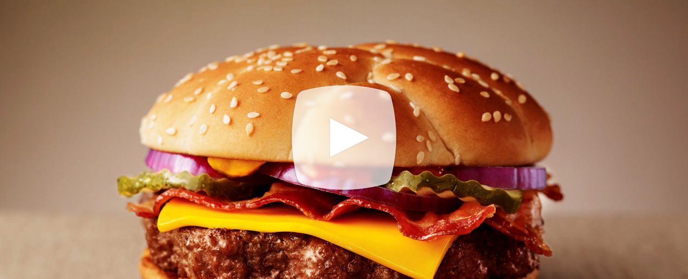

# [My Burger by McDonald's](#my-burger)

# [Audi Sudden Motion Banner](#audisms)

---
{: #my-burger}

# “My Burger” by McDonald’s
The worlds first crowdsourced McDonald’s Burgers

### Facts
+ For the first time in the history of McDonald’s, fans can create their own burger.
+ More than 116,000 burgers published.
+ The five most popular burgers were featured in restaurants all over Germany.
+ Fans' personalised TV spots advertise their own creations.
+ With 21 million contacts, the campaign reached one in four Germans.

{:.fifty}

**The problem** McDonald's turned 40 in Germany and we didn't wanted to add yet another product promotion ourselves. With dozens of new products every year, customers became bored with the same preset burgers over and over again.

**Our solution** Instead of developing burgers internally, we let the burger lovers out there do what they do best: tell & show us what they want!  

**Execution** We built a burger configurator online, available to everybody who always wanted to build his or her own burger. The campaign was a huge success – rewarded with an Effie for exactly that reason. 116.000 burgers were created (that's one every 26 seconds), 1.5 million votes were collected for the various burgers and with all the buzz that was generated, we reached every fourth German in total.
{:.clear}

**My role** As part of the concept team I shaped vital parts like the gallery and helped to bring the biggest leap of this campaign to life: let the fans do the buzz with no media spent! I was able (as part of the strategic department) to convince the client that we shift media budgets into content spendings – before everybody else was doing it.

More details on [Razorfish](http://en.razorfish.de/#/Projectdetails/McDonalds.-Mein-Burger) & [Heye](http://www.heye.de/de/arbeiten/mcdonalds-mein-burger/)

[&#65516;](#audisms)
{:.next}

---
{: #audisms}

## Audi Sudden Motion Sensor Banner

<iframe src="//player.vimeo.com/video/29720635?title=0&amp;byline=0&amp;portrait=0&amp;color=ff9933" width="740" height="592" frameborder="0" webkitallowfullscreen mozallowfullscreen allowfullscreen></iframe>
